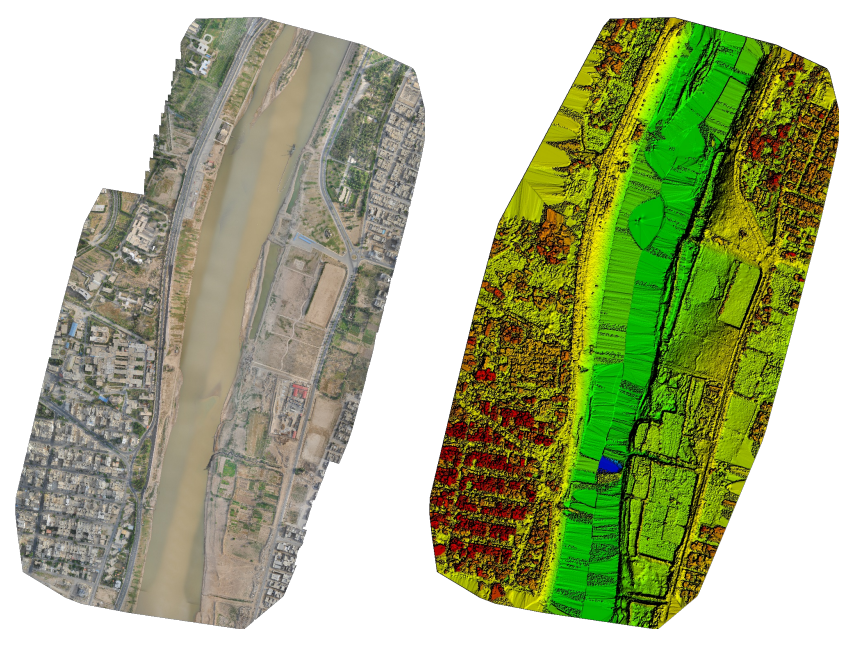

# Large Scene Instance Segmentation of Palm Trees in Ahvaz City Using U-Net Architecture on High-Resolution UAV Images.

Class of Remote Sensing of Water, Soil, and Plants - Second Semester 2021-22 - `Dr. Hamzeh saeid.hamzeh@ut.ac.ir`

`BY: MOIEN RANGZAN`

## Abstract

Detection and Segmentation of Plam trees is an essential task for monitoring, geolocating, and estimating their canopy size, individual health indices, and yields, especially in large urban areas where we have a complex mixture of different tree species that could be hard to distinguish using traditional machine learning techniques. In this work, we used the fully-convolutional U-Net Deep Learning architecture trained on more than 1000 annotated palm trees in our region to segment the palm trees. We also used Patching and Smooth Unpatcing techniques to use this algorithm on large scenes, where with the help of Connected Component Labeling, we separated and counted each individual tree. This workflow shows excellent potential in segmenting palm trees, with a meager False-Negative ratio. Also, basic Image pro-cessing techniques such as rationing and thresholding for the False Positives lowered the errors substan-tially. This U-Net-based technique can reduce the cost of monitoring palm trees in large cities and could be beneficial to policymakers.

U-Net[8] is a "fully-convolutional" CNN architecture introduced by Ronneberger O. et al. This models need fewer training images than the traditional CNNs. This ar-chitecture uses pooling layers instead of upsampling operators to increase the resolu-tion of the output; it also uses "skip-connection" to concatenate each contracting layer to its corresponding extracting layer to increase the localization of objects.

![U-Net architecture[8]](imgs/unet.png)

## Study Area
The Study area is located in Ahvaz, Khuzestan, Iran, (31:15:33.7, 48:40:3.23) and was acquired in the year 2020 at the shores of Karoon River; the flight campaign was held from morning to afternoon. The camera model was "S.O.D.A" from snseFly with an F-stop of  f/4  and shutter speed of 0.001 [s/sec], the ISO speed was 125 with a wide Focal length of 11 [mm], which flew at the altitude of 230 [m]. The campaign resulted in 440 scenes of 5472x3684 [pxp], with a total area of 2.789 [{km}^2] covered and Average Ground Sampling Distance (GSD) of 5.20[cm]. These images are in RGB.

