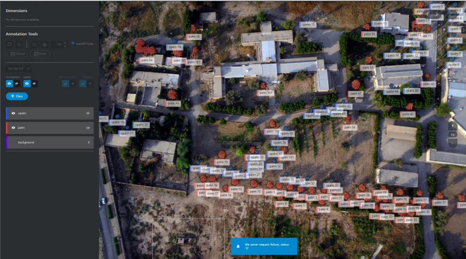
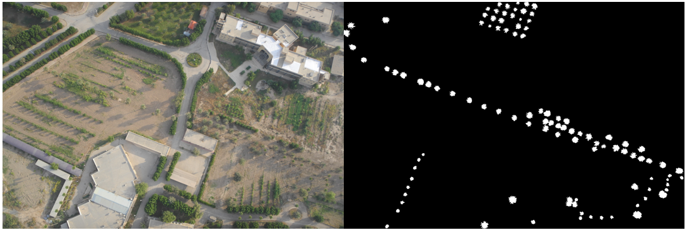
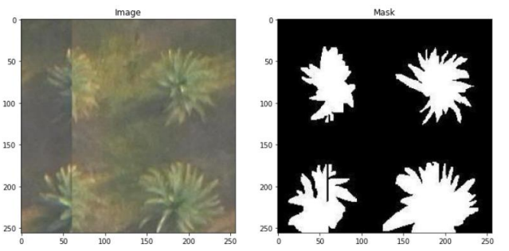
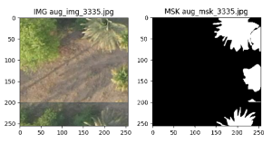
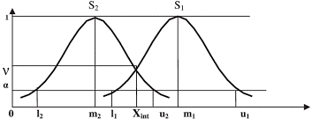
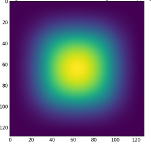
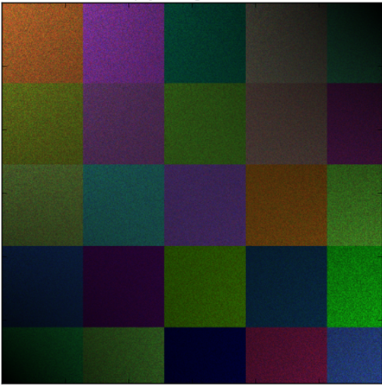
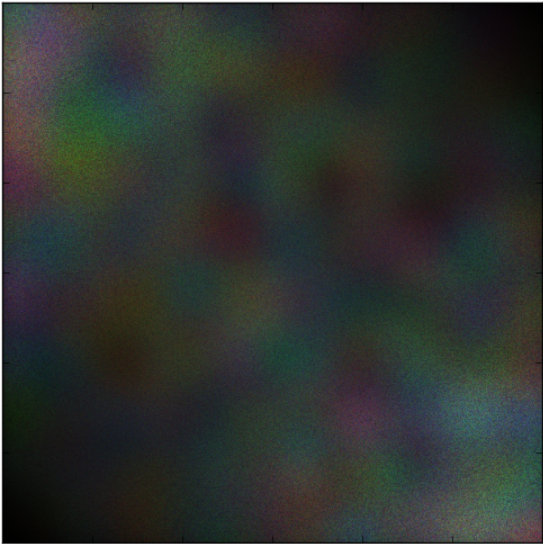
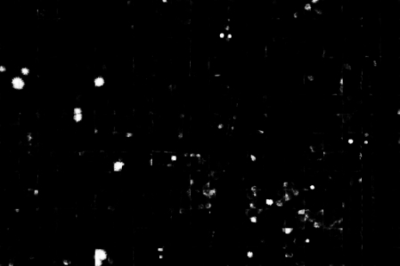
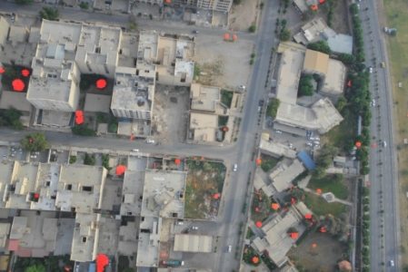

# Large Scene Segmentation of Palm Trees in Ahvaz City Using U-Net Architecture on High-Resolution UAV Images.

Class of Remote Sensing of Water, Soil, and Plants

Second Semester 2021-22

Dr. Saeid Hamzeh saeid.hamzeh@ut.ac.ir - BY: MOIEN RANGZAN

---
## Abstract

Detection and Segmentation of Plam trees is an essential task for monitoring, geolocating, and estimating their canopy size, individual health indices, and yields, especially in large urban areas where we have a complex mixture of different tree species that could be hard to distinguish using traditional machine learning techniques. In this work, we used the fully-convolutional U-Net Deep Learning architecture trained on more than 1000 annotated palm trees in our region to segment the palm trees. We also used Patching and Smooth Unpatcing techniques to use this algorithm on large scenes, where with the help of Connected Component Labeling, we separated and counted each individual tree. This workflow shows excellent potential in segmenting palm trees, with a meager False-Negative ratio. Also, basic Image pro-cessing techniques such as rationing and thresholding for the False Positives lowered the errors substan-tially. This U-Net-based technique can reduce the cost of monitoring palm trees in large cities and could be beneficial to policymakers.

## TODO
Global Map of Oil Palm Plantations
https://developers.google.com/earth-engine/datasets/catalog/BIOPAMA_GlobalOilPalm_v1

## Architecture
U-Net[8] is a "fully-convolutional" CNN architecture introduced by Ronneberger O. et al. This models need fewer training images than the traditional CNNs. This ar-chitecture uses pooling layers instead of upsampling operators to increase the resolu-tion of the output; it also uses "skip-connection" to concatenate each contracting layer to its corresponding extracting layer to increase the localization of objects.

![U-Net architecture[8]](imgs/unet.png)
*Figure 1. U-Net architecture[8]*

## Dataset
### Study Area
The Study area is located in Ahvaz, Khuzestan, Iran, (31:15:33.7, 48:40:3.23) and was acquired in the year 2020 at the shores of Karoon River; the flight campaign was held from morning to afternoon. The camera model was "S.O.D.A" from snseFly with an F-stop of  f/4  and shutter speed of 0.001 [s/sec], the ISO speed was 125 with a wide Focal length of 11 [mm], which flew at the altitude of 230 [m]. The campaign resulted in 440 scenes of 5472x3684 [pxp], with a total area of 2.789 [{km}^2] covered and Average Ground Sampling Distance (GSD) of 5.20[cm]. These images are in RGB.

*Figure 2. The Orthophoto of the area and its corresponding Digital Surface Model (DSM) Made with Pix4D*

### Data Annotation

For data annotation, we used APEER Annotation Tool[9] approximately annotat-ed more than 1000 palm trees in two categories of Tall Palms and Short Palms, which we eventually decided to convert into binary masks (palm and not palm).
Multiple image contrast enhancement services are provided by APEER when an-notating, which facilitates the process.

*Figure 6. An example of scene annotation using APEER*

*Figure 7. An entire scene and its corresponding mask*

### Patching The Data

To feed the dataset to the network, we must divide it into smaller patches of 512x512, 256x256, 128x128, and so on, depending on the amount of RAM and compu-ting power available.
Small patches give the network confined context, whereas larger patches necessi-tate more max-pooling layers, which decreases the localization accuracy[8].
In our particular instance, we made a decision to utilize a patch size of 256 by 256 pixels using the Patchify[10] python package. Additionally, we opted to use an over-lapping of 32 pixels in order to prevent the loss of texture at the patch margins

*Figure 8. Some of the patches and their corresponding masks*

### Augmenting the data
One of the most challenging tasks is enhancing the generalization capacity of deep learning models. Generalizability measures how well a model performs when tested on previously viewed data (training data) against data that has never been seen before (testing data). Models that have poor generalizability have overfitted the training data to an excessive degree. 

Increasing the quantity of the training data is one method for avoiding overfit-ting. However, because developing a large dataset can be costly and time-consuming in many cases, we can utilize various transformations on an already existing dataset to expand its size, a process known as Data Augmentation.
In this work, we used two augmentation methods:
•	Geometric Transfromations;
•	Random Mixing;
In terms of implementation, Geometric Transformations are characterized by their simplicity[11]. This study used Random Rotation, Displacement, Horizontal, and Vertical Flips.
Another approach is to crop images and concatenate the croppings together ran-domly[11].

**Figure 10.** Some of the Augmented data

Using these augmentation techniques, we increased our dataset size to 5000 im-ages. We applied these methods only to the images with a fair potion of palm in them (images with a mask with more than 1 percent of True pixels as shown in equation 1.).

$\frac{True\ mask\ pixels}{All\ mask\ pixels\ (256\times256)}<0.01$

### Final Data
The final dataset was divided into 800 Training images and 200 Validation imag-es, and we used augmentations to expand the training data size to 5000. We also in-cluded 200 images without palms to ensure that the model is not biased toward "Must Find Trees."

## Loss
For our model, we used an Adam Optimizer with a Learning Rate of {10}^{-4} and the Binary Cross-Entropy Loss (equation 2.).

$C=-\frac{1}{N} \sum_{i=1}^N\left(y_i \log \left(\hat{y}_i\right)+\left(1-y_i\right) \log \left(1-\hat{y}_i\right)\right)$

## Smooth Un-patching

Our model was trained on a 256x256, but since it is a fully convolutional CNN, it can be fed images of any size, but this is not the best practice. The optimum technique would be to break the test images into the same size as training images and then un-patch the results, but separating images into patches with no overlap causes sharp edges, with low certainty on the edges. **Smoothly-Blend-Image-Patches**[12] GitHub repository was made precisely for this purpose.

We will divide the test scenes into patches with 128-pixel overlap and then combine these patches using the Gaussian Distribution Function.

**Figure 11.** Two 1D Gaussian Functions represent the pixel weights in a weighted mean merging[13].

**Figure 12.** A 2D Gaussian Function Window.

|||
| :-: | :-: |
|(**a**)|(**b**)|

**Figure 14.** Comparison of Merge parches Cheaply and Smooth: (**a**) Un-patching using no overlap; (**b**) Un-patching Using Gaussian Weighted mean and patches with overlap[12]

## Network Output Results

Figure 16. depicts some of the results. The confidence in detecting tree canopy areas is satisfactory, except on the edges, which may be due to the fact that locating these areas was challenging for a human agent in the annotating process in some instances. However, we can see that the network generalized adequately to mask the isolated branches.

`  `**Figure 13**** **(a)** Network output after 25 epochs

`  `**Figure 14 (b)** Network output after 25 epochs

Figure 17. show two instances of human agents missing a palm canopy that the network still found.

**Figure 17.** Network finding missed pam canopies.

*3.1. Full Scene Instance Segmentation*

We used this part as our test evaluation, meaning the data we are using was seen by the network neither directly nor with another viewing angle in the training section. The patching and un-patching of the test images were done as explained in section 2.

3\.1.1 Cheap Un-patching

For the cheap un-patching, we split the image into 256x256 patches with no overlap, then fed it to the network and unpatched it using the Patchify library. The effect of sharp edges is strongly observable in this workflow.

The thresholding was performed in an empirical method, meaning that it was accomplished via the use of trial and error and the determination of the optimal threshold value.

**Figure 15**** Cheaply patched mask without thresholding.

**Figure 16.** Final mask after thresholding applied on the original image.

### Smooth Un-patching

#TODO

## Evaluation metrics

The most reported accuracy metrics in using CNNs in the field of vegetation are[14]:

- Overall accuracy;
- precision;
- Recall;
- F1-Score;
- Intersection over Union (IoU)

#TODO

## Discussion

In this work, we employed an enhanced version of U-Net to segment individual trees in Ahvaz City; the proposed method achieved excellent accuracy in the True positive palms, and the amount of false positive was drastically reduced by utilizing various image processing techniques. 

The accuracy of shape prediction in our network demonstrates that it may be used to estimate the tree canopy radius accurately. Freudenberg et al. demonstrated that U-Net could be used for palm tree detection with good precision[1]; in this work, we illustrated that not only is U-Net good at a detection task, but it can also be effectively used for palm tree segmentation, with virtually flawless precision in estimating the canopy size radius.

## Conclusions

**#TODO**

## References

[1]	M. Freudenberg, N. Nölke, A. Agostini, K. Urban, F. Wörgötter, and C. Kleinn, “Large scale palm tree detection in high resolution satellite images using U-Net,” *Remote Sensing*, vol. 11, no. 3, Feb. 2019, doi: 10.3390/rs11030312.

[2]	Y. Ampatzidis and V. Partel, “UAV-based high throughput phenotyping in citrus utilizing multispectral imaging and artificial intelligence,” *Remote Sensing*, vol. 11, no. 4, Feb. 2019, doi: 10.3390/rs11040410.

[3]	K. Yarak, A. Witayangkurn, K. Kritiyutanont, C. Arunplod, and R. Shibasaki, “Oil palm tree detection and health classification on high‐resolution imagery using deep learning,” *Agriculture (Switzerland)*, vol. 11, no. 2, pp. 1–17, Feb. 2021, doi: 10.3390/agriculture11020183.

[4]	S. Egli and M. Höpke, “Cnn-based tree species classification using high resolution rgb image data from automated uav observations,” *Remote Sensing*, vol. 12, no. 23, pp. 1–17, Dec. 2020, doi: 10.3390/rs12233892.

[5]	K. O’Shea and R. Nash, “An Introduction to Convolutional Neural Networks,” Nov. 2015, [Online]. Available: http://arxiv.org/abs/1511.08458

[6]	R. Raj, J. P. Walker, R. Pingale, R. Nandan, B. Naik, and A. Jagarlapudi, “Leaf area index estimation using top-of-canopy airborne RGB images,” *International Journal of Applied Earth Observation and Geoinformation*, vol. 96, Apr. 2021, doi: 10.1016/j.jag.2020.102282.

[7]	Z.-H. Zhou and J. Feng, “Deep Forest,” Feb. 2017, [Online]. Available: http://arxiv.org/abs/1702.08835

[8]	O. Ronneberger, P. Fischer, and T. Brox, “U-Net: Convolutional Networks for Biomedical Image Segmentation,” May 2015, [Online]. Available: http://arxiv.org/abs/1505.04597

[9]	“APEER.”

[10]	W. ’Weiyuan, “Patchify.”

[11]	C. Shorten and T. M. Khoshgoftaar, “A survey on Image Data Augmentation for Deep Learning,” *Journal of Big Data*, vol. 6, no. 1, Dec. 2019, doi: 10.1186/s40537-019-0197-0.

[12]	“Smoothly-Blend-Image-Patches.”

[13]	H. A. Hefny, H. M. Elsayed, and H. F. Aly, “Fuzzy multi-criteria decision making model for different scenarios of electrical power generation in Egypt,” *Egyptian Informatics Journal*, vol. 14, no. 2, pp. 125–133, 2013, doi: 10.1016/j.eij.2013.04.001.

[14]	T. Kattenborn, J. Leitloff, F. Schiefer, and S. Hinz, “Review on Convolutional Neural Networks (CNN) in vegetation remote sensing,” *ISPRS Journal of Photogrammetry and Remote Sensing*, vol. 173. Elsevier B.V., pp. 24–49, Mar. 01, 2021. doi: 10.1016/j.isprsjprs.2020.12.010.
