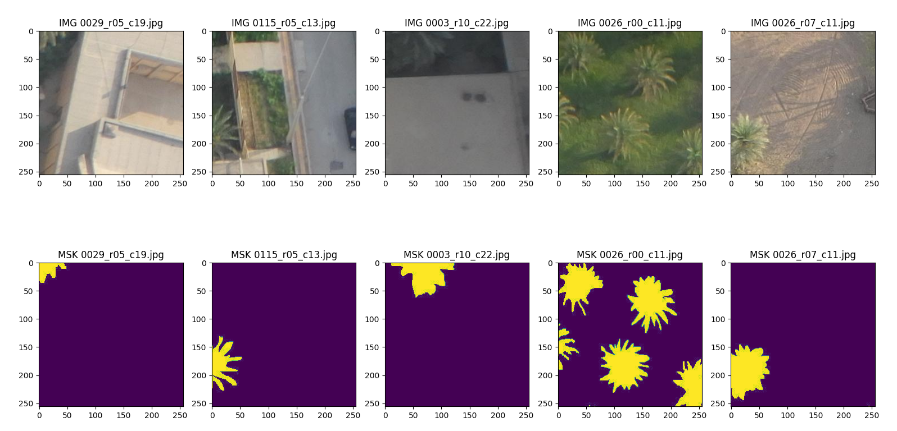

# Large Scene Instance Segmentation of Palm Trees in Ahvaz City Using U-Net Architecture on High-Resolution UAV Images.

Class of Remote Sensing of Water, Soil, and Plants

Second Semester 2021-22

Dr. Saeed Hamzeh saeid.hamzeh@ut.ac.ir - BY: MOIEN RANGZAN
---
## Abstract

Detection and Segmentation of Plam trees is an essential task for monitoring, geolocating, and estimating their canopy size, individual health indices, and yields, especially in large urban areas where we have a complex mixture of different tree species that could be hard to distinguish using traditional machine learning techniques. In this work, we used the fully-convolutional U-Net Deep Learning architecture trained on more than 1000 annotated palm trees in our region to segment the palm trees. We also used Patching and Smooth Unpatcing techniques to use this algorithm on large scenes, where with the help of Connected Component Labeling, we separated and counted each individual tree. This workflow shows excellent potential in segmenting palm trees, with a meager False-Negative ratio. Also, basic Image pro-cessing techniques such as rationing and thresholding for the False Positives lowered the errors substan-tially. This U-Net-based technique can reduce the cost of monitoring palm trees in large cities and could be beneficial to policymakers.

## Architecture
U-Net[8] is a "fully-convolutional" CNN architecture introduced by Ronneberger O. et al. This models need fewer training images than the traditional CNNs. This ar-chitecture uses pooling layers instead of upsampling operators to increase the resolu-tion of the output; it also uses "skip-connection" to concatenate each contracting layer to its corresponding extracting layer to increase the localization of objects.

![U-Net architecture[8]](imgs/unet.png)
*Figure 1. U-Net architecture[8]*

## Study Area
The Study area is located in Ahvaz, Khuzestan, Iran, (31:15:33.7, 48:40:3.23) and was acquired in the year 2020 at the shores of Karoon River; the flight campaign was held from morning to afternoon. The camera model was "S.O.D.A" from snseFly with an F-stop of  f/4  and shutter speed of 0.001 [s/sec], the ISO speed was 125 with a wide Focal length of 11 [mm], which flew at the altitude of 230 [m]. The campaign resulted in 440 scenes of 5472x3684 [pxp], with a total area of 2.789 [{km}^2] covered and Average Ground Sampling Distance (GSD) of 5.20[cm]. These images are in RGB.

*Figure 2. The Orthophoto of the area and its corresponding Digital Surface Model (DSM) Made with Pix4D*

## Data Annotation

For data annotation, we used APEER Annotation Tool[9] approximately annotat-ed more than 1000 palm trees in two categories of Tall Palms and Short Palms, which we eventually decided to convert into binary masks (palm and not palm).
Multiple image contrast enhancement services are provided by APEER when an-notating, which facilitates the process.

*Figure 6. An example of scene annotation using APEER*

*Figure 7. An entire scene and its corresponding mask*

## Patching The Data

To feed the dataset to the network, we must divide it into smaller patches of 512x512, 256x256, 128x128, and so on, depending on the amount of RAM and compu-ting power available.
Small patches give the network confined context, whereas larger patches necessi-tate more max-pooling layers, which decreases the localization accuracy[8].
In our particular instance, we made a decision to utilize a patch size of 256 by 256 pixels using the Patchify[10] python package. Additionally, we opted to use an over-lapping of 32 pixels in order to prevent the loss of texture at the patch margins

*Figure 8. Some of the patches and their corresponding masks*

## Augmenting the data
One of the most challenging tasks is enhancing the generalization capacity of deep learning models. Generalizability measures how well a model performs when tested on previously viewed data (training data) against data that has never been seen before (testing data). Models that have poor generalizability have overfitted the training data to an excessive degree. 

Increasing the quantity of the training data is one method for avoiding overfit-ting. However, because developing a large dataset can be costly and time-consuming in many cases, we can utilize various transformations on an already existing dataset to expand its size, a process known as Data Augmentation.
In this work, we used two augmentation methods:
•	Geometric Transfromations;
•	Random Mixing;
In terms of implementation, Geometric Transformations are characterized by their simplicity[11]. This study used Random Rotation, Displacement, Horizontal, and Vertical Flips.
Another approach is to crop images and concatenate the croppings together ran-domly[11].

*Figure 10. Some of the Augmented data*